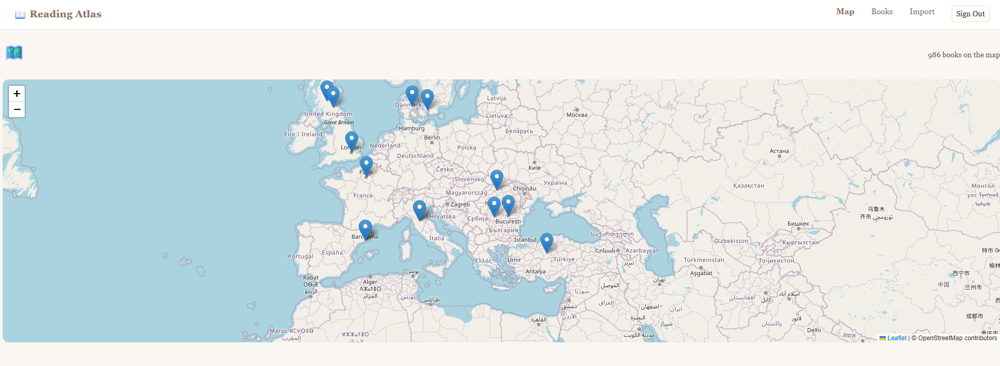

# 📖 Reading Atlas

> An interactive map of books you've read, powered by AI location suggestions.



Reading Atlas turns your reading history into a visual journey across the world. Every book you've read gets placed on an interactive map — based on where the story takes place or where the author is from. With 986+ books already mapped, you can explore your literary travels at a glance.

---

## ✨ Features

- **Interactive world map** — every book pinned to its location (Leaflet.js + OpenStreetMap)
- **AI-powered location suggestions** — type a title and author, Gemini AI suggests the location automatically
- **Drag-to-adjust pins** — confirm or correct the AI suggestion directly on the map, with reverse geocoding to update the place name
- **CSV import** — import your reading history from any CSV file (Goodreads export supported); 987 books imported in one click
- **Duplicate detection** — exact match + fuzzy matching with Levenshtein distance (≥85% similarity triggers a warning)
- **Book detail pages** — full notes, location on map, AI suggest for books without a location, edit and delete
- **Filters & stats** — filter by genre, year, author; see countries explored, average rating, favourite genre
- **Multi-user auth** — JWT authentication, each user sees only their own books
- **Responsive** — works on desktop and mobile

---

## 🛠 Tech Stack

| Layer | Technology |
|---|---|
| Frontend | Angular 19 (standalone components, signals-ready) |
| Backend | .NET 8 Web API |
| Database | SQL Server (EF Core, Code First migrations) |
| Map | Leaflet.js + OpenStreetMap |
| AI | Google Gemini API (free tier) |
| Auth | JWT Bearer tokens |
| Reverse geocoding | Nominatim (OpenStreetMap, free) |

---

## 🏗 Architecture & Key Decisions

**Repository + Service pattern** — clean separation between data access (repositories), business logic (services), and HTTP concerns (controllers). Each layer is injected via interfaces, making it straightforward to swap implementations.

**EF Core Code First** — schema defined in C# models, migrations applied automatically. `UserId` indexed on the Books table for performant multi-user queries.

**AI as a suggestion, not a source of truth** — Gemini suggests a location, but the user always confirms or adjusts before saving. A drag-and-drop pin + reverse geocoding step ensures the saved coordinates reflect the user's intent, not just the AI's output. This "human-in-the-loop" design prevents hallucinated locations from silently entering the database.

**Generic CSV import** — the import endpoint accepts any CSV with a `Title` column (all other columns optional), not just Goodreads exports. Dates are parsed across six common formats; duplicates are detected before insert; errors are reported per-row without stopping the full import.

**Levenshtein duplicate detection** — titles with ≥85% string similarity trigger a soft warning (not a block), allowing the user to save different editions of the same work while still catching accidental duplicates.

---

## 🚀 Running Locally

### Prerequisites
- .NET 8 SDK
- Node.js 18+
- SQL Server (local instance)
- Google Gemini API key (free at [aistudio.google.com](https://aistudio.google.com))

### Backend

```bash
cd ReadingAtlas
```

Add your secrets (never commit these):
```bash
dotnet user-secrets set "Jwt:Key" "your-secret-key-min-32-chars"
dotnet user-secrets set "Jwt:Issuer" "ReadingAtlasApi"
dotnet user-secrets set "Jwt:Audience" "ReadingAtlasApp"
dotnet user-secrets set "Jwt:ExpiryHours" "24"
dotnet user-secrets set "Gemini:ApiKey" "your-gemini-key"
dotnet user-secrets set "Gemini:Model" "gemini-2.5-flash"
```

Update `appsettings.Development.json` with your SQL Server connection string, then:

```bash
dotnet ef database update
dotnet run
```

API runs at `https://localhost:7187`. Swagger available at `/swagger`.

### Frontend

```bash
cd reading-atlas-frontend
npm install
npm start
```

App runs at `http://localhost:4200`.

---

## 📋 API Endpoints

| Method | Endpoint | Description |
|---|---|---|
| POST | `/api/auth/register` | Create account |
| POST | `/api/auth/login` | Login, returns JWT |
| GET | `/api/books` | Get all books for current user |
| POST | `/api/books` | Add a book |
| PUT | `/api/books/{id}` | Update a book |
| DELETE | `/api/books/{id}` | Delete a book |
| GET | `/api/books/check-duplicate` | Exact + fuzzy duplicate check |
| POST | `/api/locations/suggest` | AI location suggestion |
| POST | `/api/import/csv` | Bulk import from CSV |
| GET | `/api/import/template` | Download CSV template |

---

## 🗺 Roadmap

- [ ] ISBN lookup — scan a barcode with your phone camera, auto-fill title and author
- [ ] PWA support — install as a mobile app (`ng add @angular/pwa`)
- [ ] AI insights — monthly reading summaries generated by Gemini
- [ ] Multiple locations per book — for stories that span several countries
- [ ] Social features — share your reading map publicly

---

## 📁 Repository Structure

```
ReadingAtlas/          ← .NET Web API
├── Controllers/       ← HTTP layer (Books, Auth, Import, Locations)
├── Services/          ← Business logic
├── Repositories/      ← Data access (EF Core)
├── Models/            ← EF Core entities
├── DTOs/              ← Request/response shapes
└── Migrations/        ← EF Core migrations

reading-atlas-frontend/   ← Angular app
├── src/app/
│   ├── pages/         ← Routed pages (Map, Books, Import, Login...)
│   ├── components/    ← Reusable components (MapView, BookForm, StatsPanel...)
│   ├── services/      ← HTTP services (BookService, AuthService)
│   ├── models/        ← TypeScript interfaces
│   ├── guards/        ← Auth guard
│   └── interceptors/  ← JWT interceptor
```

---

*Built with Angular, .NET 8, SQL Server, Leaflet.js and Google Gemini AI.*
